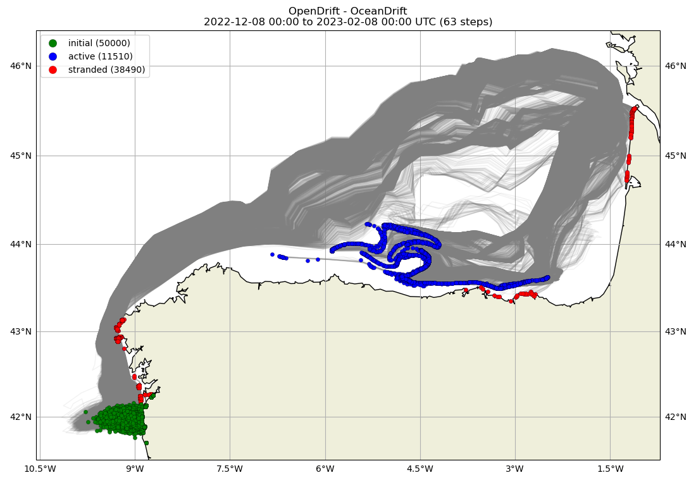
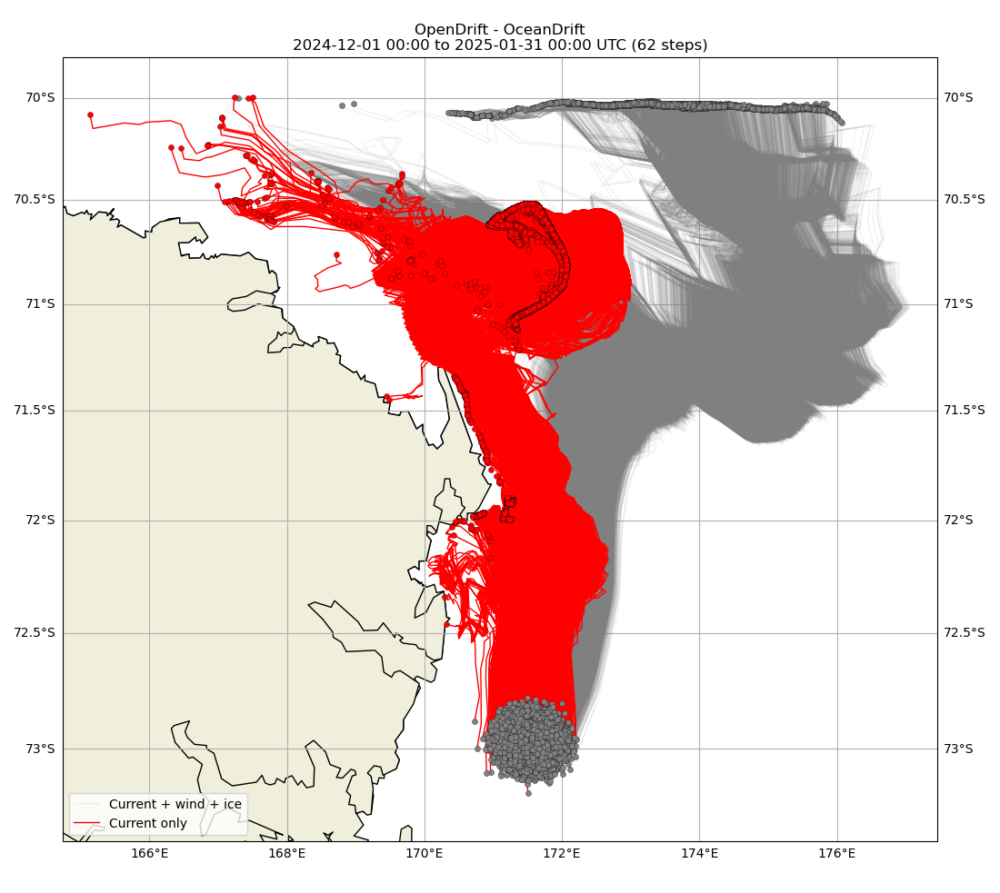
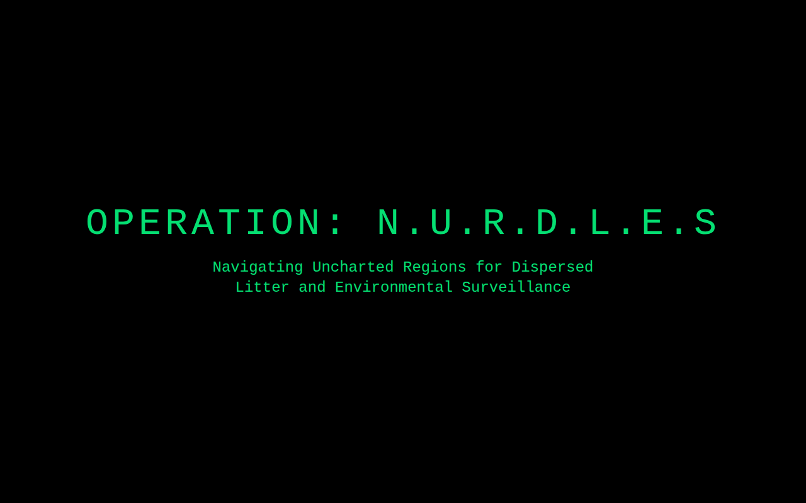

# Operation N.U.R.D.L.E.S — nurdle spill drift simulation

Where do plastic pellets ("nurdles") go after a spill at sea? This project simulates their drift
with [OpenDrift](https://opendrift.github.io/) (`OceanDrift`), forced by Copernicus Marine ocean
currents, winds and sea ice, and presents the result on a small mission-themed website.
Made for the ULISSES 2025 project.

Two scenarios, 50 000 particles each, hourly time step, 2 months:

| Real case: *Toconao* container spill, Galicia (Dec 2022) | Hypothetical spill in the Ross Sea, Antarctica (Dec 2024) |
|---|---|
|  |  |
| Green: release, blue: still drifting, red: washed ashore. About 77% of the particles strand, from Galicia along the whole Cantabrian coast to the French Atlantic coast. | Current + wind + ice (grey) against current only (red): leaving out wind and ice sends the pellets onto the Victoria Land coast instead of north-east into open water. |

Animations of both runs are in `simulations/*.mp4`.



## Running the simulation

1. Create the conda environment (installs OpenDrift and the Copernicus Marine toolbox):
   ```bash
   conda env create -f environment.yml
   conda activate opendrift
   ```
2. Create a `.env` file:
   ```
   CMDS_USERNAME=   # Copernicus Marine username
   CMDS_PASSWORD=   # Copernicus Marine password
   PARTICLES_NUMBER=50000
   ```
3. Run `opendrift_nurdle_spill_simulation.ipynb`. Current and wind data are downloaded into
   `data/` on the first run. The Ross Sea run also reads a sea-ice file
   (`data/ross_sea_nurdle_spill_ice_2024-12-01_2025-01-31.nc`, from the Copernicus product
   `SEAICE_GLO_SEAICE_L4_NRT_OBSERVATIONS_011_001`) that has to be downloaded separately.

## Website

React + TypeScript + Vite + Tailwind, with a day slider that scrubs through the simulation video.

```bash
cd website
npm install
npm run dev      # local development
npm run deploy   # build and publish to GitHub Pages
```
